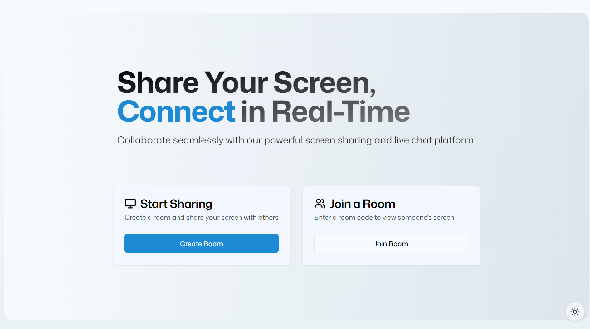

# Screen Sharing Application - Xcreenshare

A real-time screen sharing application built with Next.js, WebRTC, and PeerJS. Create or join rooms to share your screen with others instantly.

## 🚀 Features

- Real-time screen sharing
- Room-based sharing system
- Cross-browser support
- Fullscreen mode
- Simple and intuitive interface

## 🛠️ Built With Bleeding Edge Tech Stack

- [Next.js](https://nextjs.org/) v15 - React framework
- [PeerJS](https://peerjs.com/) - WebRTC abstraction
- [Tailwind CSS](https://tailwindcss.com/) v4 beta - Styling
- [shadcn/ui](https://ui.shadcn.com/) - UI components
